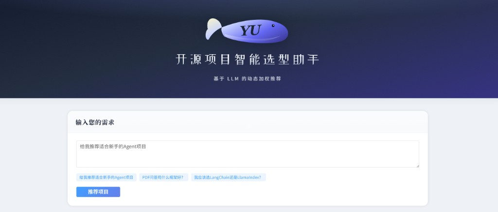
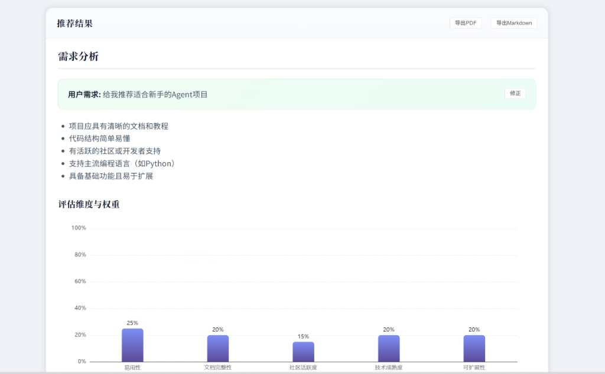
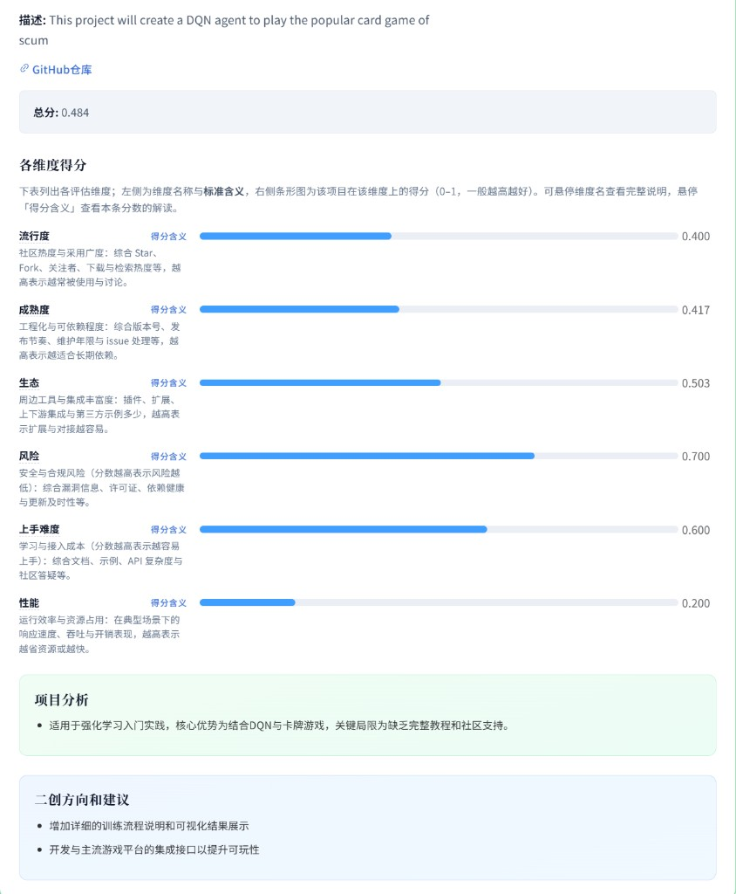

# 开源项目智能选型助手

基于 **Supervisor 多专家流水线** 与 **LLM 动态加权** 的开源项目推荐系统：理解自然语言需求，在 GitHub / PyPI 等渠道检索候选库，多维度打分排序，并在 Web 端展示需求分析、权重与项目报告。

---

## 界面预览

<p align="center">
  
  <br />
  <em>首页：品牌标识、需求输入与快捷提问</em>
</p>

<p align="center">
  
  <br />
  <em>推荐结果：需求摘要、要点拆解与评估维度权重（柱状图）</em>
</p>

<p align="center">
  
  <br />
  <em>单个项目：各维度得分、项目分析与二创建议</em>
</p>

---

## 解决的痛点

- **选型主观**：用结构化评估与加权总分辅助决策，而不是只看 Star。
- **需求说不清**：LLM 将自然语言转为检索意图与维度权重，适配不同场景（新手友好、PDF 问答、框架对比等）。
- **垂直场景难搜**：在通用检索之上做语义过滤与多专家打分，覆盖插件、二次开发等需求。

---

## 核心能力

- **自然语言需求分析**：关键词、检索查询、任务理解与维度权重。
- **多源检索**：GitHub 为主，条件触发时补充 PyPI 等渠道（实现见 `recommendation/phases.py` 与 `core/platform_apis.py`）。
- **多维度评估**：流行度、成熟度、生态、风险、场景匹配、趋势等（专家 Agent 见 `agents/experts/`）。
- **动态加权总分**：推荐排序使用 LLM 给出的权重与维度得分加权（见 `recommendation/phases.py`）。
- **前端**：Vue 3 + Element Plus + ECharts；支持导出 PDF / Markdown、需求修正与结果展示。

---

## 项目结构（当前仓库）

```text
GitHub-Catcher-Agent/
├── backend/
│   ├── api/
│   │   └── api.py                 # FastAPI：POST /api/recommend、GET /api/health
│   ├── agents/
│   │   ├── evaluators.py
│   │   └── experts/               # 流行度、成熟度、生态、风险、场景、趋势等专家
│   ├── core/
│   │   ├── llm_client.py          # LLM 调用与提示逻辑
│   │   ├── config.py
│   │   ├── platform_apis.py       # GitHub / PyPI 等平台 API
│   │   └── security.py            # 输入规范化与安全策略
│   ├── langgraph_supervisor/      # Supervisor 编排（上游能力封装）
│   ├── recommendation/
│   │   ├── entrypoints.py         # analyze_user_need：对外统一入口
│   │   ├── supervisor.py        # Supervisor + 多专家 Handoff 流水线
│   │   ├── phases.py              # 准备、意图、搜索、过滤、评估、收尾等阶段
│   │   ├── context.py / state.py / chat_model.py
│   │   └── tests/
│   └── tools.py
├── frontend/
│   ├── src/
│   │   ├── App.vue                # 主界面与图表
│   │   └── components/
│   │       └── LogoYuFish.vue     # 品牌图形（YU 鱼形标志）
│   ├── index.html
│   └── package.json
├── docs/
│   └── images/                    # README 界面截图
├── Makefile                       # 测试与 lint（pytest / ruff 等）
├── pyproject.toml
├── uv.lock
└── README.md
```

---

## 架构说明

调度层使用 **langgraph_supervisor** 的 `create_supervisor`，将任务按顺序交给多位「专家」：准备与安全校验 → 意图与权重 → 检索 → 过滤 → 多维度评估 → 报告与排序。各阶段具体逻辑集中在 **`recommendation/phases.py`**，会话状态在 **`recommendation/context.py`** 中维护。

与「仅一条 LangGraph 状态机图」不同，本仓库以 **Supervisor + 分阶段函数** 组织业务，便于单独测试检索、缓存与加权排序等行为。

---

## 技术栈

| 层级 | 技术 |
|------|------|
| 后端 | Python 3.10+、FastAPI、Uvicorn |
| 编排与 Agent | LangGraph、LangChain Core、langgraph_supervisor |
| 模型 | 兼容 OpenAI 式 API（通过环境变量配置基址与密钥） |
| 数据与检索 | GitHub API、PyPI（按需） |
| 前端 | Vue 3、Vite、Element Plus、ECharts、Axios |

---

## 快速开始

### 1. 后端

安装运行 API 所需依赖（示例）：

```bash
pip install fastapi uvicorn requests langgraph langchain-core langchain-openai
```

在仓库根目录或 `backend` 下将 `backend` 加入模块搜索路径后启动（以下示例在 **`backend` 目录** 执行）：

```bash
cd backend
export PYTHONIOENCODING=utf-8
export MODEL_API_KEY="你的_API_Key"
export MODEL_API_URL="https://你的模型网关地址"
python api/api.py
```

（Windows PowerShell 可使用 `$env:MODEL_API_KEY="..."` 等形式设置环境变量。）

默认监听 **`http://0.0.0.0:8004`**。健康检查：`GET http://127.0.0.1:8004/api/health`。

推荐接口示例：

```bash
curl -X POST "http://127.0.0.1:8004/api/recommend" \
  -H "Content-Type: application/json" \
  -d "{\"user_need\": \"给我推荐适合新手的 Agent 项目\"}"
```

### 2. 前端

```bash
cd frontend
npm install
npm run dev
```

开发服务器默认由 Vite 指定端口（见终端输出）。前端通过环境变量 **`VITE_API_BASE_URL`** 指向后端，未设置时默认为 **`http://127.0.0.1:8004`**。

生产构建：

```bash
npm run build
```

### 3. 测试与代码质量（可选）

```bash
make test
make lint
```

---

## 配置说明

| 变量 | 含义 |
|------|------|
| `MODEL_API_KEY` | 大模型 API 密钥 |
| `MODEL_API_URL` | 大模型 API 基址（OpenAI 兼容） |
| `MODEL_CANDIDATES` | 可选，逗号分隔的候选模型名 |
| `PYTHONIOENCODING` | 建议设为 `utf-8`，避免 Windows 控制台中文乱码 |

---

## 许可证

MIT License
